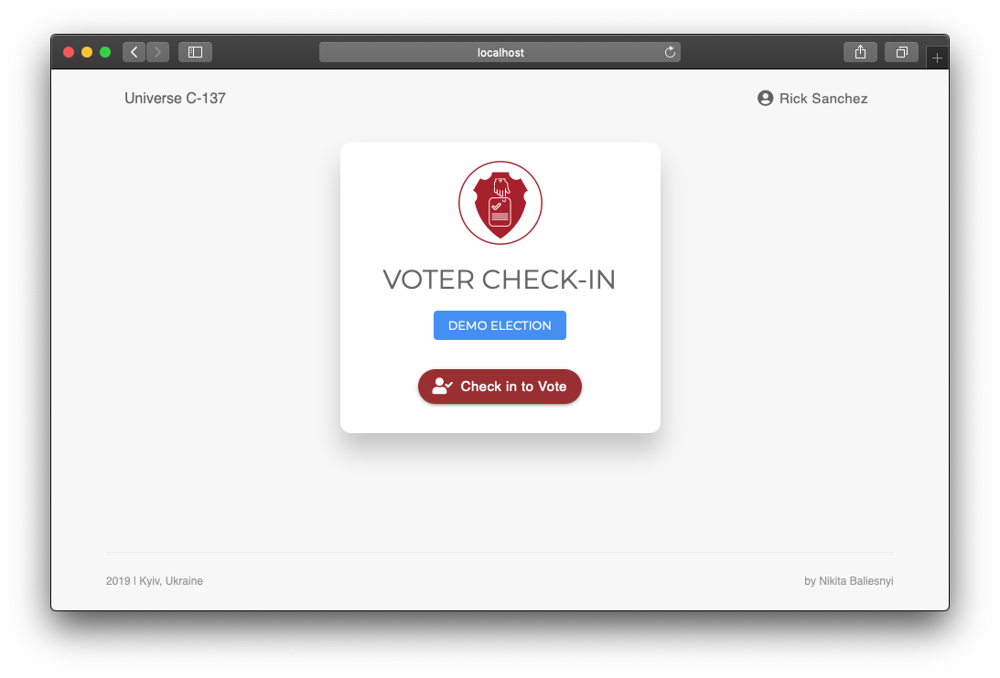

# react-election-registration



This is a simple voting check-in app for use by students in university elections. 

**Some of its features:**

- Dazzling-ly fast, performant and lightweight
- Sign in and forms with custom validation – we had _super specific_ requirements
- Configuration: change titles, accepted IDs, validation rules etc. – you can configure the heck out of it

**What I used here:**

- [Material-UI](https://material-ui.com/) for theming and [styled-components](https://github.com/styled-components/styled-components/) for custom styling
- [Storeon](https://github.com/storeon/storeon) for state management (tiny 175-byte version of Redux)
- [axios](https://github.com/axios/axios) for REST API
- [Sentry](https://sentry.io/) for error monitoring – this turned the debugging of 25,000 user sessions in several hours from chaos to a piece of cake :)

## Run demo

In the application folder:

1. Clone this repo
```
git clone git@github.com:nick-baliesnyi/react-election-registration.git
```

2. Open the project folder and Install dependencies. This will take ~1min.
```
cd react-election-registration && npm install
```

3. Start the application. This should open your browser at http://localhost:3000 with the running app.
```
npm start
```

4. You've made it! Have fun! 🎉